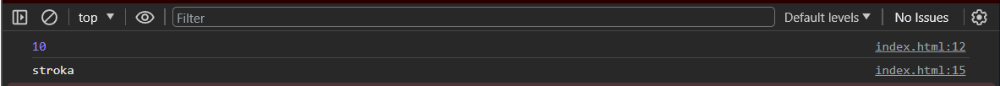
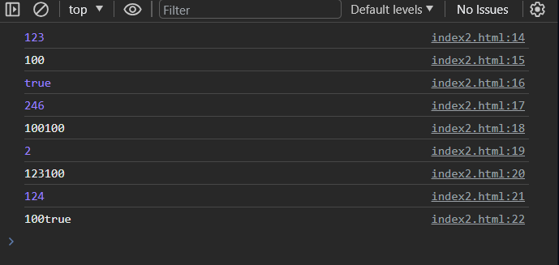
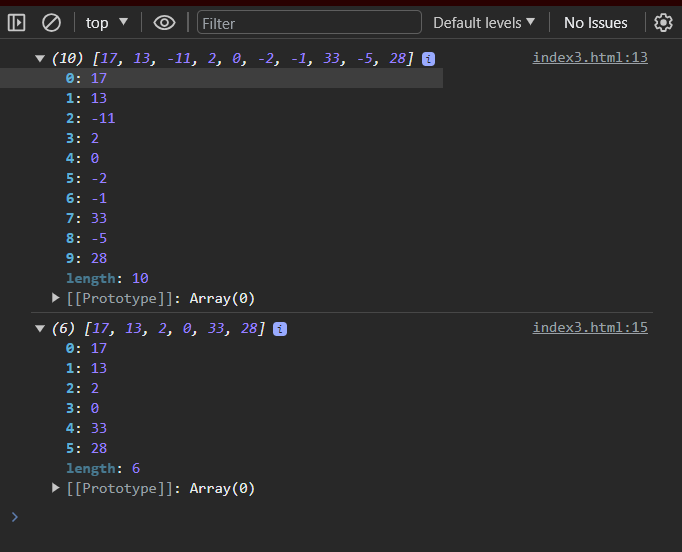
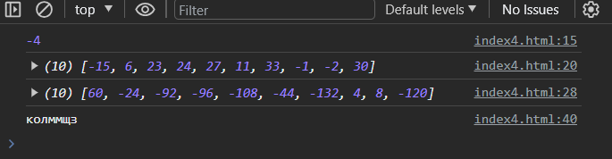
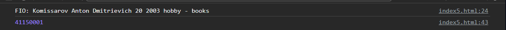

# Задание 1: Работа с переменными
## Код html
```
<!DOCTYPE html>
<html lang="ru">
<head>
    <meta charset="UTF-8"/>
    <meta name="viewport" content="width=device-width, initial-scale=1.0"/>
    <title>JS</title>
</head>
<body>
<script>
    let apple = 10;
    alert(apple);
    console.log(apple);
    let conditions = "stroka";
    alert(conditions);
    console.log(conditions);
    console.log('Good game is ' + condition);
</script>
</body>
</html>
```

## В результате alert(apple) появляется окно
Подтвердите действие : 10
## В результате alert(conditions) появляется окно 
Подтвердите действие : stroka

# Ответы на вопросы
1. Через какой оператор Вы объявили переменную? 
* через оператор let
2. Какие доступны операторы для объявления переменных? В чём их отличия?
* const определяет константы, которые нельзя менять после определения var определяет простую, глобальную, внеблочную переменную.
* let переменные имеют блочную видимость, а ещё их нельзя объявить повторно вне зависимости от того, в каком месте функции реально находятся(при условии, что она не находится во вложенной функции). поэтому принято их писать в начале кода программы.
3. Что происходит при вызове alert()?
* Alert выводит нам бесячее сообщение в браузере, в котором можно что то обустроить
4. Как Вы думаете для чего может использоваться console.log()
* для того чтобы было легче понять где ошибки, тк если использовать просто alert(), то вывод не фиксируется в консоли. или для другой работы в консоли

# Задание 2: Магия конкатенации
## Код
```
<!DOCTYPE html>
<html lang="ru">
<head>
    <meta charset="UTF-8"/>
    <meta name="viewport" content="width=device-width, initial-scale=1.0"/>
    <title>JS</title>
</head>
<body>
<script>
    let apple = 123,
        sliva = '100',
        cherry = true;
    console.log(apple);
    console.log(sliva);
    console.log(cherry);
    console.log(apple + apple);
    console.log(sliva + sliva);
    console.log(cherry + cherry);
    console.log(apple + sliva);
    console.log(apple + cherry);
    console.log(sliva + cherry);
</script>
</body>
</html>
```
## Вывод в console


# Задание 3: Работа с массивами
код
```
<!DOCTYPE html>
<html lang="ru">
<head>
    <meta charset="UTF-8"/>
    <meta name="viewport" content="width=device-width, initial-scale=1.0"/>
    <title>JS</title>
</head>
<body>
<script>
let array = []
for (let i=0; i<10; i++)
    array.push(Math.floor( -15 + 50 * Math.random()));
console.log(array);
array = array.filter(num => num >= 0);
console.log(array);
</script>
</body>
</html>
```
## Вывод в console


# Задание 4: Работа с функциями
код
```
<!DOCTYPE html>
<html lang="ru">
<head>
    <meta charset="UTF-8"/>
    <meta name="viewport" content="width=device-width, initial-scale=1.0"/>
    <title>JS</title>
</head>
<body>
<script>

    function getRandomInt(max, min) {
    return Math.floor(min + Math.random() * max);
    }
let pip = getRandomInt(25, -5)
console.log(pip);

let array = []
for (let i=0; i<10; i++)
    array.push(Math.floor( -15 + 50 * Math.random()));
console.log(array);

    function mass2(array, number){
    let new_array = array.map(element => element * number);
    return new_array;
    }

let array2 = mass2(array, pip);
console.log(array2);

let random_word = function() {
  let alphabet = 'йцукенгшщзхъфывапролджэячсмитьбю';
  let word = '';
  for (let i = 0; i < 7; i++) {
    let index = Math.floor(Math.random() * alphabet.length);
    word += alphabet[index];
  }
  return word;
};

console.log(random_word());
</script>
</body>
</html>
```
## Вывод в console

# Задание 5: Работа с объектами
код
```
<!DOCTYPE html>
<html lang="ru">
<head>
    <meta charset="UTF-8"/>
    <meta name="viewport" content="width=device-width, initial-scale=1.0"/>
    <title>JS</title>
</head>
<body>
<script>
 let obect = {};
    obect.firstName = 'Anton';
    obect.surname = 'Komissarov';
    obect.patronymic = 'Dmitrievich';
    obect.birthday = '29.03.2003';
    obect.hobby = 'books';
    obect.group = 'АСБ-037';
obect.get_inform = function () {
    let year = this.birthday.substring(6,10);
    let age = 2023 - year;
    let inf = 'FIO: ' + this.surname + ' ' + this.firstName + ' ' + this.patronymic + ' ' + age + ' '  + year + ' hobby - ' + this.hobby;
    return inf;
    }
alert(obect.get_inform());
console.log(obect.get_inform());

let obect2 = {
    'Лю Цзяна': 10000000,
    'Лю Янбин': 10000000,
    'Ху': 1000000,
	'Komissarov': 9000000,
    'Цяо': 10000000,
    'Пархоменко': 200000,
    'Шепелева': 500000,
    'Макаревич': 100000,
    'Гисс': 150000,
    'Ким': 200000,
    'Боровинский': 1,
    };
let salary = 0;
for (let key in obect2){
    salary += obect2[key];
    }
console.log(salary);
</script>
</body>
</html>

```
## В результате alert(apple) появляется окно

## вывод в console

